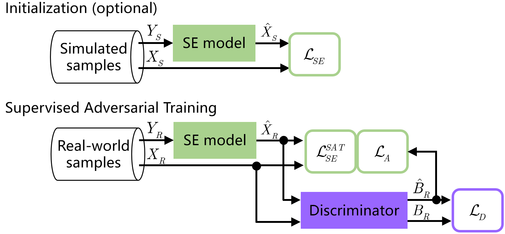

# FNSE-SAT
Demo Audio and Code for the Upcoming Paper “Enhancing Far-Field Speech with Supervised Adversarial Training”

## Training structure diagram


## The architecture of MlResDis


The non-causal model has been incorporated into the confidentiality clause of the cooperative company, so there is no plan to open source in the short term...

## cite
```bibtex
@article{lei2025enhancing,
  title={Enhancing real-world far-field speech with supervised adversarial training},
  author={Lei, Tong and Hu, Qinwen and Hou, Zhongshu and Lu, Jing},
  journal={Applied Acoustics},
  volume={229},
  pages={110407},
  year={2025},
  publisher={Elsevier}
}
